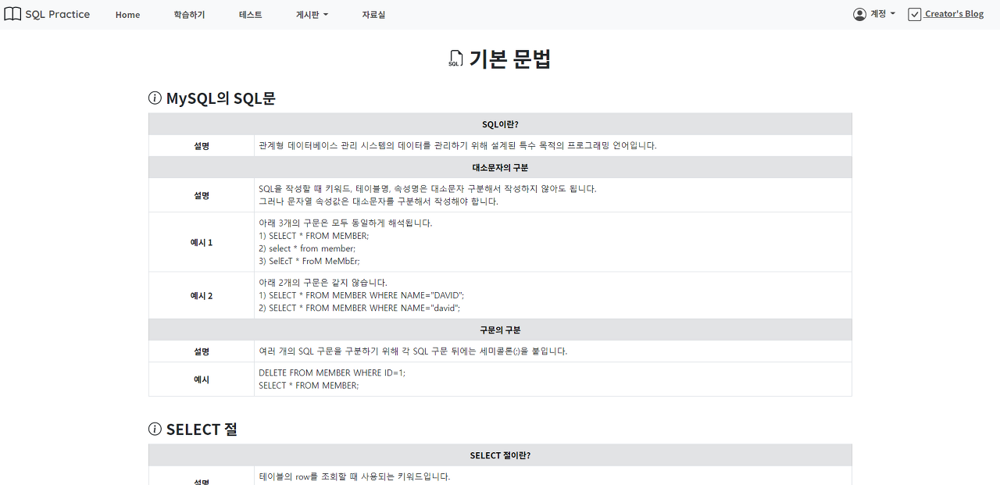
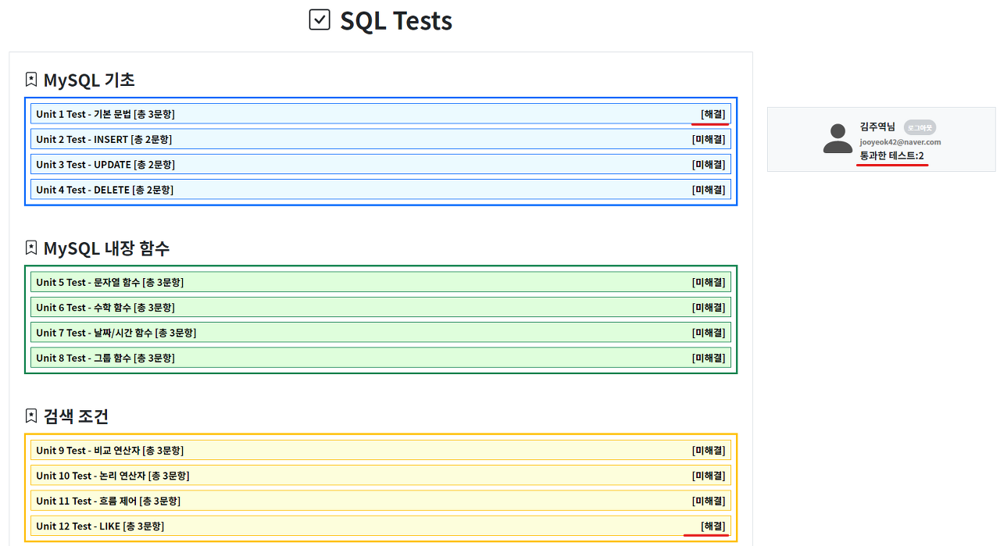
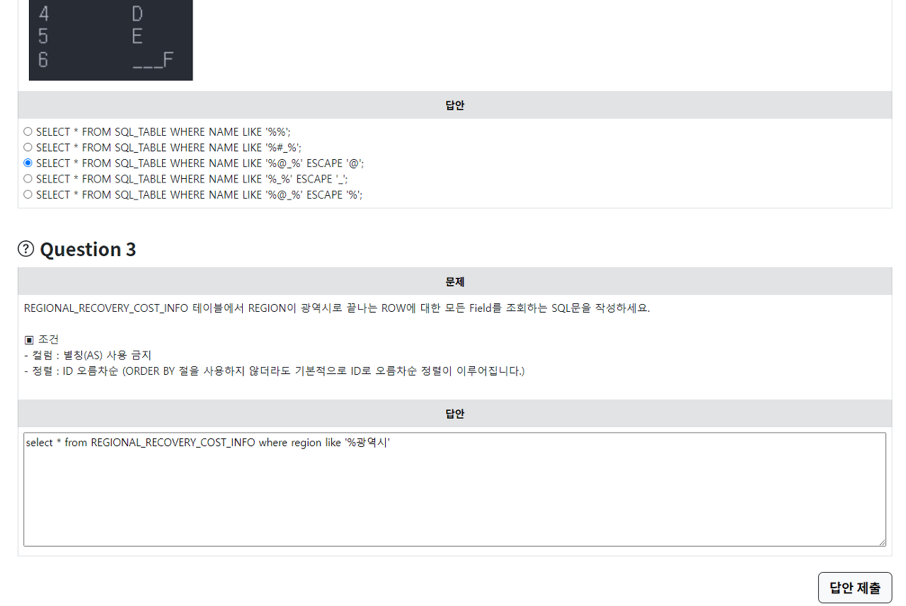
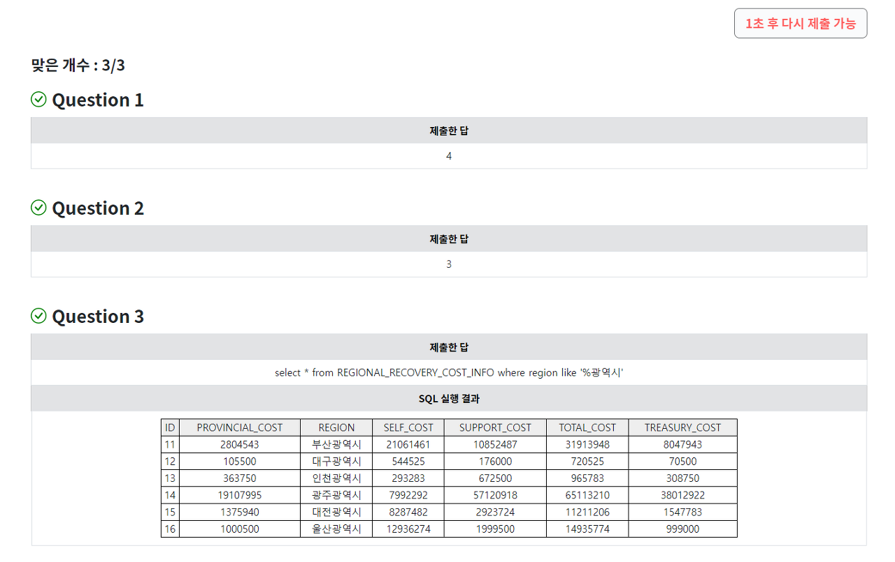
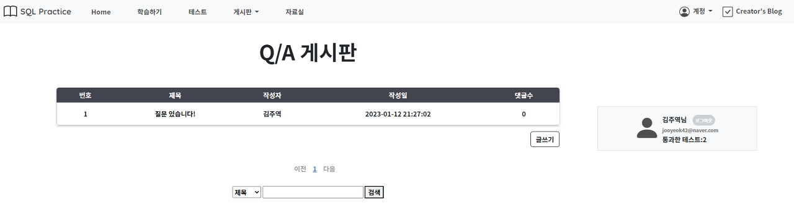

## 개발 프로젝트/[팀] SQL 교육 사이트 - SQL Practice

### 프로젝트 소개

- 프로젝트 이름 : SQL 교육 사이트 - SQL Practice
- 프로젝트 설명 : SQL 입문자들에게 SQL의 기본 문법부터 다중 테이블 연산까지의 내용을 교육시켜주고 학습 테스트 및 Q&A 게시판을 제공한다.
- 기술 스택 : SpringBoot, JPA Hibernate, Spring AOP, Validation, OpenAPI(JSON), Spring Security(PasswordEncoder), MyBatis, DB(MySQL, H2), Ajax, Spring Test, JUnit, Front-end(mustache, bootstrap, html, css, js)
- 진행 인원 및 작업 기간 : 4인, 2022.7.08 ~ 2023.01.11 (~8월 학습 기간, 9월~ 프로그래밍 기간)
- 사용 에디터 : IntelliJ
- 사용 프로젝트 : Spring Maven
- 버전 관리 툴 : Git

## 본인 담당 작업

- Q/A 게시판, Bug 게시판 기능 제공
- 회원가입, 로그인 기능 제공
- 학습 테스트 문제 출제

## 1. 웹 애플리케이션 구성

## 2. UI 구성

### 1) Home

- nav를 통한 메뉴의 이동

- 동적인 슬라이드쇼를 지원하는 carousel을 사용하여 웹 페이지의 개요를 보여줌

###

### 2) 학습하기

- 총 17개의 학습 주제로 구성

-

- 학습하기 Unit 1

##

### 3) 테스트

- 총 17개의 학습 테스트로 구성

- "/test"에서 해결 여부에 따른 [해결] 및 [미해결] 표시

- 해결한 테스트 개수를 "/test"의 우측 유저 정보창에 표시

- 학습 테스트 Unit 12 문제

- 문제 제출 시 바로 아래에 결과 표시

##

### 4) Q/A 게시판 & 버그 문의 게시판

- 하단에 최대 5개의 페이지 인덱스 표시, 한 페이지 당 10개의 글 표시

- 글 수정/삭제, 댓글 수정/삭제 기능 (댓글의 경우 ajax로 동작)

##

### 5) 자료실

- DB 쿼리 변환 사이트, 프로그래머스 SQL 고득점 Kit 등 SQL 학습에 도움이 될 만한 자료를 공유

### 

## 3. 동작 부가 설명
### 1) 학습 테스트 채점 로직

- 사용자에게 받은 주관식(SQL) 답안의 경우에는 금지 키워드(DROP, DELETE, UPDATE 등)가 포함되어 있는지를 검증하고, 사용자가 작성한 SQL문을 Mybatis으로 실행하여 가져온 결과를 채점함
####
- 상세 채점 로직은 "[팀 프로젝트] SQL 교육 사이트 - 채점 로직 상세 설명" 포스팅에 작성함

-> https://kimcoder.tistory.com/557

- 채점 결과 반영 : 채점 메소드의 반환을 AOP가 감지(@AfterReturning)하여 채점 결과 객체(TestResult)를 통해 유저의 테스트 현황 정보를 DB에 업데이트

#### 2) OpenAPI 호출

- 데이터 샘플은 OpenAPI로 수집함
- RestTemplate을 통해 다른 서버에 있는 OpenAPI를 가져오는 방법과 csv파일로 다운받아서 파싱하는 방법을 사용함. 데이터를 가져오는 동작은 서버 실행 시 Listener을 통해 최초 1회만 실행됨

### 3) 게시판

- Jpa Auditing을 통해 게시글 엔티티의 생성과 변경 시간을 감지하여 시간 정보를 필드에 저장

- 댓글의 생성과 삭제는 Ajax로 동작

- 글 엔티티와 댓글 엔티티는 지연로딩 방식의 JPA 연관관계 매핑으로 관리

- 게시글이 10개가 넘어가게 되면 다음 페이지가 생성됨

### 4) 계정

- Spring Security의 PasswordEncoder를 통해 사용자의 비밀번호를 암호화한 상태로 DB에 저장하고, 로그인 시 암호 복호화 후 검증

- Bean Validation(@Pattern, @Size)와 정규표현식을 이용한 패스워드, 이메일 값 검증

- 로그인한 유저에 대한 객체는 HttpSession에 최대 7200초동안 저장

## 4. 최적화 내용

- 모든 JPA 연관관계 매핑에 지연로딩(Lazy) 방식 적용

※ 지연 로딩으로 설정된 필드를 강제로 초기화해야 할 때는 EagerService라는 서비스 계층에서 트랜잭션을 열어 Hibernate.initializer 메소드로 해결
or Fetch join을 통해 연관된 객체를 함께 로딩하여 해결

- 중복되는 채점 결과 반영 로직은 AOP를 통해 처리

- 중복되는 샘플 데이터 수집 로직은 별도의 Template을 만들어 처리

- 중복되는 mustache 코드는 파일을 분리하여 다른 파일에서 분리된 파일을 참조하도록 구성

#

